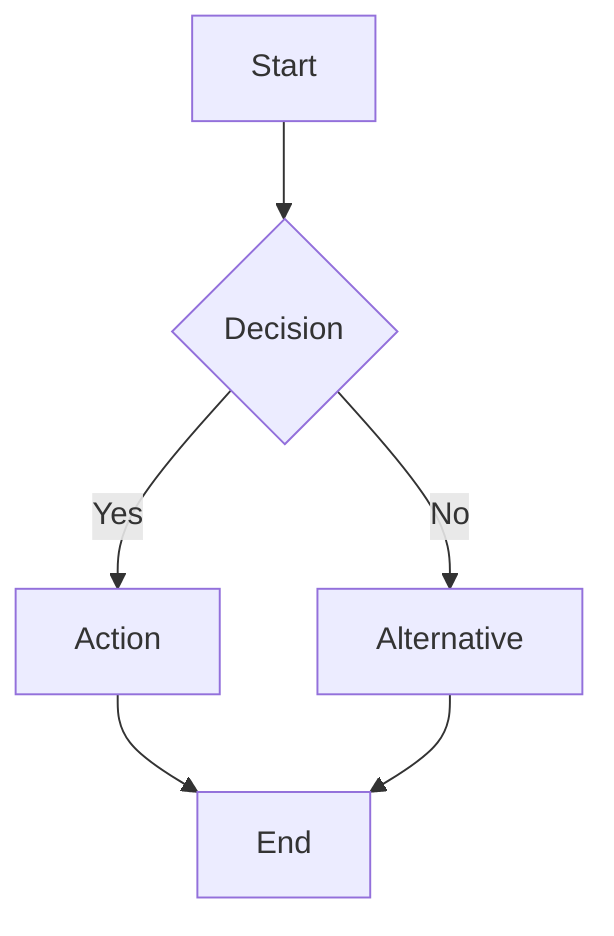
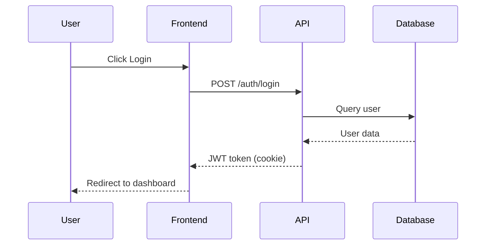
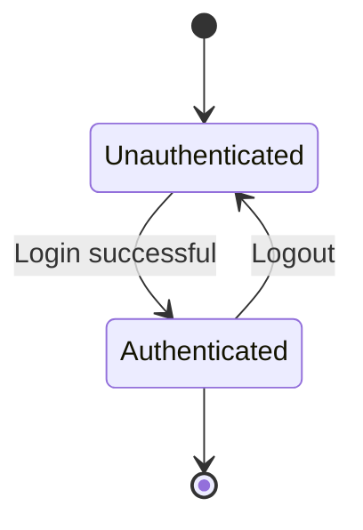
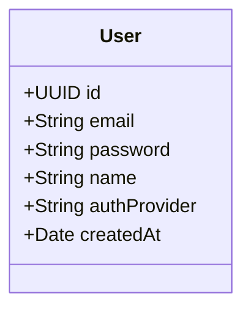

# Requirement
- read file .ai/README.md and follow documentations

# File template [file (1*)]
- follow template from top to bottom
- date created, author, summary task
- session prompt, rules, checklist
- **Session User Flow** - Step-by-step user interaction flow in plain text
- **Flow Diagram** - Visual representation using Mermaid diagram format
  - For features: Use flowchart or sequence diagram
  - For bugs: Use flowchart showing bug → fix → verify
  - For updates: Use flowchart showing current → transition → new state
- tasks to do + status
- summary action: all task done, tasks not be done and reason
- updated at and version

# Rules action
- when received a requirement follow documentations read, then choose template prompt, checklist, rule for this action
- create file note (rule, checklist, prompt) with 3 section into file name format [feature_name|update_code|fix_bug_name](1*) on folder `task_executions`
- update prompt follow requirement input into prompt section in file (1*)
- after update prompt successfully then create all task and status session note into file (1*)
- after implement tasks noted on file update status task on file (1*)
- Finally, create session summary this action: all task done, tasks not be done and reason on file (1*)

# Flow Diagram Guidelines

## When to use Mermaid diagrams:
1. **Feature Implementation** - Show user flow, API calls, data flow
2. **Bug Fix** - Show error flow and fix verification
3. **Code Update** - Show before/after architecture

## Mermaid Diagram Types:

### 1. Flowchart (for feature/bug/update flows)

### 2. Sequence Diagram (for API interactions)

### 3. State Diagram (for status changes)

### 4. Class Diagram (for data models)

